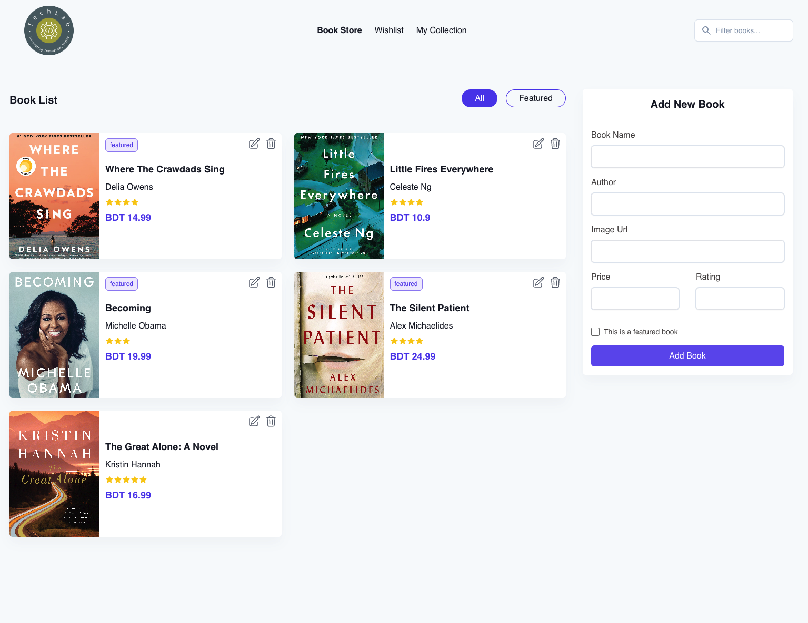

# Book Store App with Redux

## Description

This is a web application developed for a book store, featuring state management
using Redux along with other functionalities and requirements.

## Features

- **Asynchronous Data Storage**: Submitted data through the form on the right
  side is stored asynchronously on the local server.
- **Book List Display**: Displays a list of books fetched from the server in the
  "Book List" section.
- **Filtering by Tags**: Provides two tags, "All" and "Featured," in the "Book
  List" section. Selecting "Featured" filters and displays only featured books.
- **Search Bar**: Allows searching for books by name. Search results are
  filtered and displayed in the "Book List" section.
- **Edit Book Information**: Clicking on the edit icon of a card item redirects
  to the "Add New Book" form on the right side. The button text changes from
  "Add Book" to "Update Book."
- **Update Book Information**: Clicking on "Update Book" updates the book
  information, resets the form, and changes the button text back to "Add Book."
- **Delete Book**: Clicking on the delete button removes the book from the
  database.
- **State Management with Redux**: Utilizes Redux for managing application
  state, providing a centralized store for all state changes.

## Technologies Used

- Frontend: HTML, CSS, JavaScript, React
- State Management: Redux
- Backend: Node.js, Express.js
- Database: Postgres,Prisma

## Live Demo

Explore the live demo of the project
[here](https://book-store-app-brown.vercel.app/).

